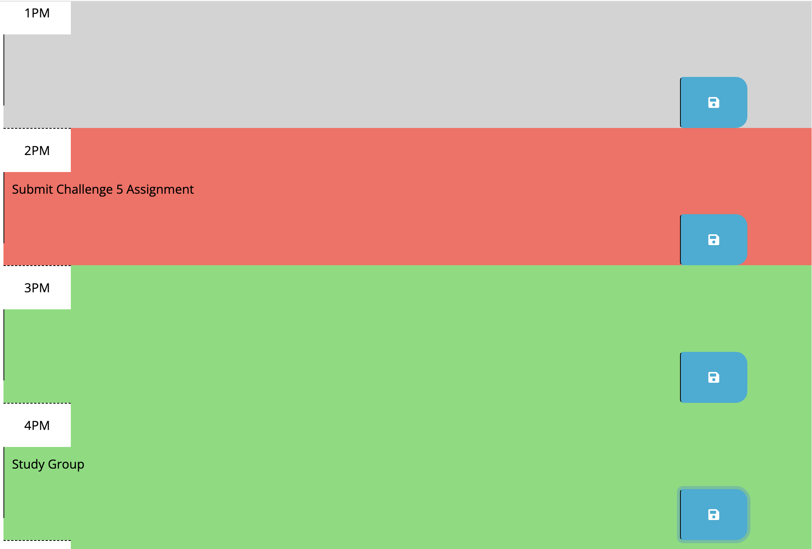

# Calendar
UCB Challenge 5. Refactor starter code to build a calendar application powered by jQuery.

## Description
Daily calendar displays current date and time. Calendar clears every event at midnight. CAlendar shows which hours are past,present, and future. When events are entered and saved, they are put into localStorage and displayed upon refreshing the page.
N/A
## Installation
N/A
## Usage
GitHub Pages: https://malxxy.github.io/calendar/
GitHUb repository: https://github.com/malxxy/calendar
 
Calendar Date and Time:

 
Calendar Home:

 
Past, Present, and Future:

 
## Credits
No collaborators.

## License
N/A